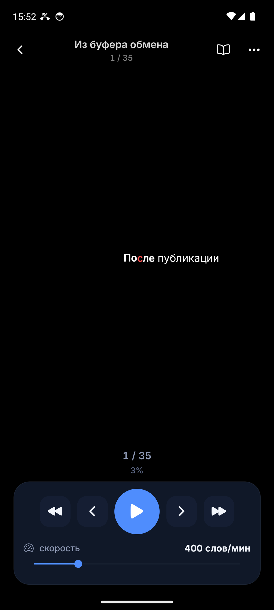
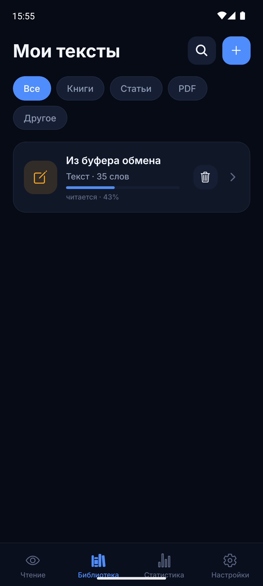
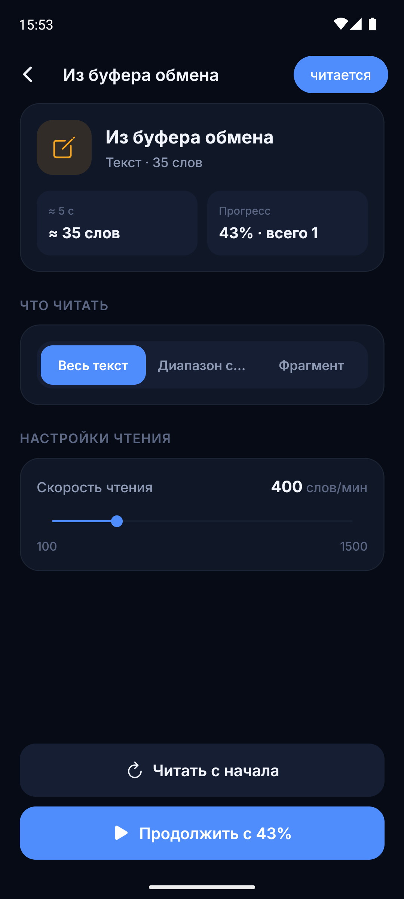
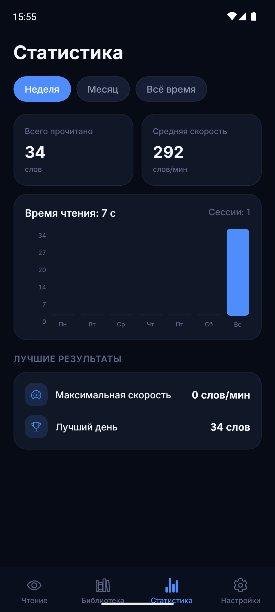
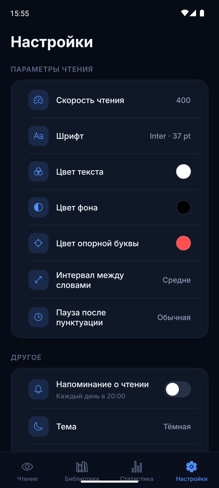
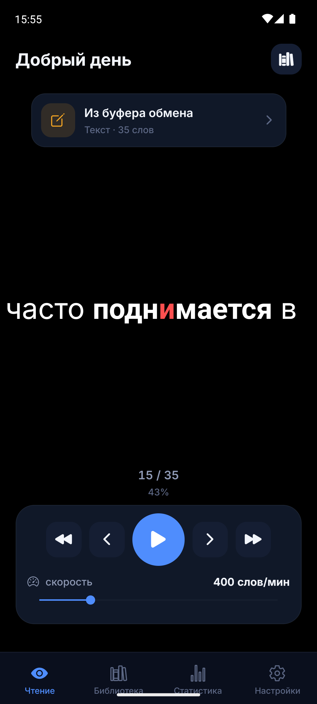

<div align="center">

#  RSVP Reading

**Читайте быстрее. Понимайте глубже.**

Скорочтение методом RSVP для Android и iOS. Слова появляются одно за другим
в фиксированной точке экрана — глазам не нужно двигаться по строке.

[](https://github.com/Qubera/rsvp-reading/releases/latest)
[](LICENSE)
[](#тесты)
[](https://expo.dev)

[Русский](#-возможности) · [English](#-rsvp-reading-english)

</div>

---

##  Скриншоты

| Чтение | Библиотека | Документ |
|:---:|:---:|:---:|
|  |  |  |

| Статистика | Настройки | Главная |
|:---:|:---:|:---:|
|  |  |  |

##  Возможности

###  RSVP-ридер
- **Точный тайминг**: 100–1500 слов/мин, смена скорости на лету без пересчёта расписания
- **ORP** — опорная буква каждого слова всегда в одной и той же точке экрана: взгляд не двигается
- **Умные паузы**: длинные слова, знаки препинания и абзацы получают больше времени автоматически
- **Контекст строки**: предыдущее и следующее слово видны по краям — чтение выглядит осмысленным
- **Жесты-«барабан»**: свайп влево/вправо листает слова по ходу движения пальца
- **Свайп-размер**: вертикальный свайп плавно меняет размер шрифта
- **Иммерсивный режим**: тап — и остаётся только текст; авто-скрытие через 10 секунд

###  Библиотека и импорт
- **TXT / MD** (UTF-8 и CP1251) · **PDF** (свой парсер: Object Streams, FlateDecode, ToUnicode) · **EPUB** · **FB2** · **веб-страницы по URL** · буфер обмена · ручной ввод
- Диапазоны чтения: весь текст / страницы / фрагмент
- Автосохранение позиции: закрыли на слове 5000 — продолжили с него

###  Статистика
- Сессии, график по дням, средняя и максимальная скорость
- Фильтры: неделя / месяц / всё время · «лучшие результаты»

###  Персонализация
- 4 шрифта: Inter, Manrope, Literata, JetBrains Mono
- Размер 24–120 pt · круглая палитра любого цвета (текст / фон / опорная буква)
- **6 тем**: Тёмная, Чёрная (OLED), Океан, Светлая, Сепия, Системная
- Языки: **Русский · Қазақша · English**
- Ежедневное напоминание о чтении — настоящее системное уведомление в 20:00

##  Приватность
Все данные хранятся **только на устройстве** (SQLite / IndexedDB). Никаких серверов, аккаунтов и телеметрии.

##  Установка

**Готовый APK** — [Releases](https://github.com/Qubera/rsvp-reading/releases/latest) → скачайте → откройте на телефоне.

**Из исходников (Android):**
```bash
git clone https://github.com/Qubera/rsvp-reading.git
cd rsvp-reading && npm install
npx expo prebuild -p android
cd android && ./gradlew assembleDebug
```

**iOS** (macOS + Xcode):
```bash
npx expo prebuild -p ios && cd ios && pod install
# открыть *.xcworkspace в Xcode → Run
```

**Разработка:**
```bash
npm install && npm start   # Expo dev-сервер
npm run typecheck          # tsc --noEmit
npm test                   # 53 unit-теста ядра
```

##  Как работает ORP

Опорная точка распознавания — буква, на которой глаз «останавливается» при чтении слова.
RSVP Reading вычисляет её для каждого слова и держит ровно на одной вертикали экрана,
разделяя слово на prefix / pivot / suffix:

```
пре | д | ыдущее    →    сле | д | ующее
```

Глазу не нужно сканировать строку — экономится до 80% движений глаз.

##  Архитектура

```
src/
├── core/       чистое ядро: ReaderEngine, TextParser, Timeline, ORP
├── data/       импортёры (TXT/PDF/EPUB/FB2/URL) + репозитории
├── domain/     агрегация статистики
├── app/        zustand-сторы, навигация
├── features/   экраны приложения
├── ui/         UI-кит и темы
├── services/   haptics, OCR (точка расширения), напоминания
└── storage/    SQLite (native) / IndexedDB (web)
```

Производительность: длительности слов — в безразмерных «юнитах», поэтому смена
скорости O(1), а поиск позиции — бинарный поиск O(log n) даже на книге в
500 000 слов.

##  Тесты
53 unit-теста ядра: тайминг движка, парсер, ORP, декодер кодировок, импортёры
(EPUB roundtrip, PDF с ToUnicode/ObjStm), статистика.

##  Планы
- [ ] OCR-распознавание страниц с камеры (архитектура готова)
- [ ] iOS-сборка через EAS
- [ ] Плавная регулировка скорости во время чтения свайпом

##  Участие
PR приветствуются! Для крупных изменений сначала откройте issue.

##  Лицензия
[MIT](LICENSE)

---

<div align="center">
<b>Русский</b> · <a href="#-rsvp-reading">English</a>
</div>

---

<div align="center">

#  RSVP Reading (English)

**Read faster. Comprehend deeper.** RSVP speed reading for Android & iOS —
words appear one at a time at a fixed point on screen, so your eyes never
scan the line.

<a href="#-screenshots">Screenshots above ↑</a>

### Features
- Precise RSVP timing, 100–1500 WPM, live speed changes at O(1)
- **ORP** — the pivot letter of every word is pinned to the same screen position
- Smart pauses for punctuation, long words and paragraphs
- **Drum-swipe** gestures: flick left/right to scrub words, swipe vertically to resize text
- Import: TXT (UTF-8/CP1251), PDF (custom parser), EPUB, FB2, URLs, clipboard
- Reading ranges, autosaved position, session statistics with charts
- 4 fonts, any color via color wheel, 6 UI themes, RU/KK/EN localization
- Fully offline — everything is stored on-device

### Download
Grab the [latest APK](https://github.com/Qubera/rsvp-reading/releases/latest) or build from source (see instructions above — Russian, code comments in English).

</div>
